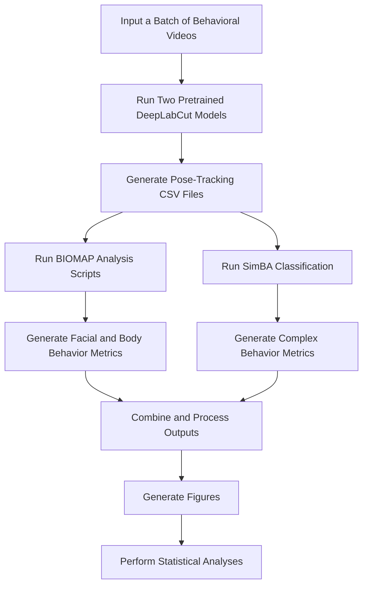

# Teaching AI to Read Mouse Behavior 🧠

**Vanderbilt BrainHack 2026 Project**

<p align="center">
  
</p>

## TL;DR

> **BrainHack Project:** Automate an existing mouse-behavior analysis workflow that uses trained machine-learning models and Python scripts but still requires substantial manual processing. The goal is to connect these components into a reproducible pipeline that produces standardized behavioral metrics, publication-ready figures, and analysis-ready datasets.

---

# Overview

The **Behavioral Inventory of Mouse Affective Pain (BIOMAP)** is a machine learning–based assay developed in the [HARMONIC Laboratory](https://www.harmoniclabvumc.com/) at Vanderbilt University Medical Center. It uses computer vision, pose estimation, behavioral classification, and custom analyses to quantify pain-related behavior in freely moving mice.

The core components of BIOMAP already exist. The current workflow uses trained **DeepLabCut** models, **SimBA**, and custom Python scripts, but researchers must run several steps separately, transfer files between programs, perform calculations, and generate figures manually.

**This project will connect and automate these components—not rebuild BIOMAP from scratch.**

Automation will improve reproducibility, standardize analyses, reduce manual effort, and make it easier to analyze larger behavioral datasets. Although BIOMAP was developed to study sound-evoked pain, the resulting tools could support other behavioral neuroscience applications.

---

# What We Are Automating



---

# Project Goal

The goal is to replace the current multi-step process with a single command:

```bash
biomap analyze data/raw_videos/
```

The automated pipeline would:

* Run trained DeepLabCut models
* Perform behavioral classification using SimBA
* Calculate behavioral metrics and composite scores
* Apply post-processing and quality-control steps
* Generate standardized figures
* Export analysis-ready datasets

---

# BrainHack Objectives

## Objective 1 — Workflow Automation

Connect the existing DeepLabCut, SimBA, and BIOMAP analysis components into a reproducible workflow with minimal user interaction.

Potential tasks include:

* Automating DeepLabCut and SimBA execution
* Standardizing file organization
* Automating existing calculations and composite scores
* Generating figures and analysis-ready tables
* Adding quality-control checks
* Improving documentation and testing

## Objective 2 — Behavioral-State Classification

As an optional exploratory track, contributors may investigate methods for distinguishing:

* Pain-related immobility
* Sleep
* Rest
* Quiet wakefulness

Potential approaches include pose-estimation features, temporal modeling, machine learning, and rule-based methods.

This objective involves new method development and is separate from the primary automation goal. A fully validated classifier is **not expected** during the BrainHack weekend.

---

# Contributor Tracks

| Track                           | Example Tasks                                      | Helpful Skills                       |
| ------------------------------- | -------------------------------------------------- | ------------------------------------ |
| Pipeline Integration            | Connect existing workflow components               | Python, software engineering         |
| DeepLabCut and SimBA            | Automate trained models and classifiers            | Computer vision, behavioral analysis |
| BIOMAP Analysis                 | Automate calculations and composite scores         | Python, data analysis                |
| Figures and Quality Control     | Generate figures and validation reports            | Visualization, statistics            |
| Documentation and Testing       | Improve instructions and test workflow steps       | GitHub, Markdown, Python             |
| Behavioral-State Classification | Explore sleep, rest, and immobility classification | Machine learning, neuroscience       |

**No prior experience with every component is expected.**

We welcome contributors from neuroscience, computer science, engineering, data science, machine learning, software engineering, and scientific visualization.

The goal is not to finish the entire pipeline in one weekend. Contributions that automate or improve individual portions of the workflow will support continued development.

---

# Project Resources

## Background and Documentation

* [BIOMAP bioRxiv Preprint](paper/BIOMAP_Biorxiv.pdf)
* [Current Workflow](docs/CURRENT_WORKFLOW.md)
* [Desired Workflow](docs/DESIRED_WORKFLOW.md)
* [Pipeline Components](docs/PIPELINE_COMPONENTS.md)
* [Video Structure](docs/VIDEO_STRUCTURE.md)
* [BIOMAP Analysis](docs/analysis/README.md)

## Software

* [Software Overview](software/README.md)
* [Install DeepLabCut](software/INSTALL_DEEPLABCUT.md)
* [Run DeepLabCut](software/RUN_DEEPLABCUT.md)
* [Install SimBA](software/INSTALL_SIMBA.md)
* [Run SimBA](software/RUN_SIMBA.md)

---

# Getting Started

1. Read the [BIOMAP bioRxiv Preprint](paper/BIOMAP_Biorxiv.pdf)
2. Review the [Current Workflow](docs/CURRENT_WORKFLOW.md)
3. Explore the [Desired Workflow](docs/DESIRED_WORKFLOW.md)
4. Follow the [Software Overview](software/README.md)
5. Browse the repository’s **Issues** tab
6. 🎉 Start hacking!

---

# Acknowledgments

Contributors will be acknowledged in future software releases, presentations, preprints, and publications in accordance with standard scientific contribution and authorship practices.
