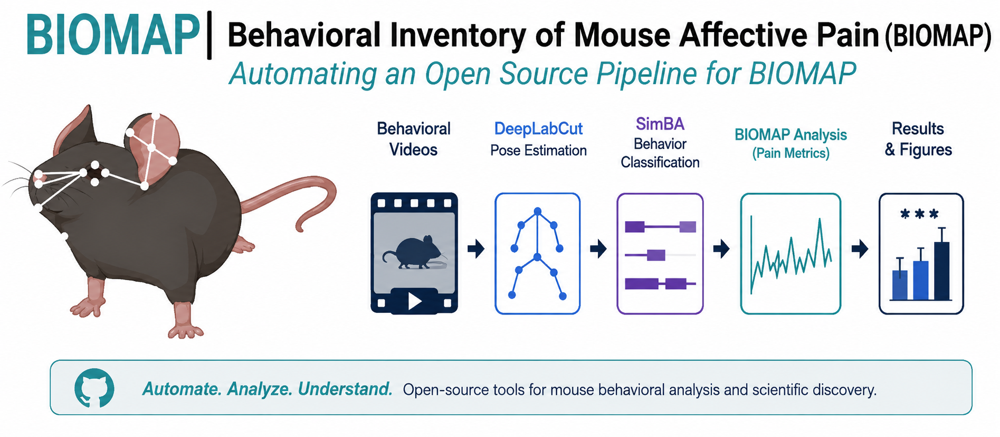
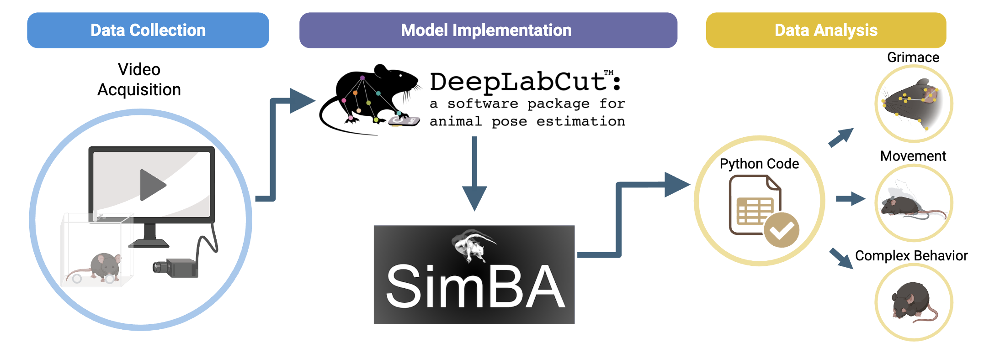

# Teaching AI to Read Mouse Behavior 🧠

**Vanderbilt BrainHack 2026 Project**

<p align="center">
  
</p>

## TL;DR

> **BrainHack Project:** Automate an existing mouse-behavior analysis workflow that currently uses trained machine-learning models and Python scripts but still requires substantial manual processing. The goal is to connect these existing components into a reproducible pipeline that processes batches of behavioral videos and produces standardized behavioral metrics, publication-ready figures, and analysis-ready datasets.

---

# Overview

The **Behavioral Inventory of Mouse Affective Pain (BIOMAP)** is a machine learning–based assay developed in the [HARMONIC Laboratory](https://www.harmoniclabvumc.com/) at Vanderbilt University Medical Center. It quantifies pain-related behavior in freely moving mice using computer vision, pose estimation, behavioral classification, and custom analysis scripts.

The core components of BIOMAP already exist. The current workflow uses trained **DeepLabCut** models, **SimBA**, and custom Python scripts to extract and analyze mouse behavior. However, researchers must still run several steps separately, transfer files between programs, perform calculations, organize outputs, and generate figures manually.

This BrainHack project will connect and automate these existing components. The goal is a reproducible, open-source pipeline that processes batches of behavioral videos with minimal user interaction.

## BIOMAP Workflow

<p align="center">
  
</p>

---

# Why This Matters

Behavioral phenotyping often requires researchers to move data between multiple software packages, perform manual calculations, organize outputs, and generate figures by hand.

Automating the existing BIOMAP workflow will:

* Improve reproducibility
* Reduce manual processing
* Standardize analyses
* Simplify onboarding
* Enable analysis of larger behavioral datasets
* Support collaborative software development

Although BIOMAP was originally developed to study sound-evoked pain, the resulting software could support a broad range of behavioral neuroscience applications.

---

# What We Are Automating

The core analysis tools are already functional, but they are currently run as separate stages with manual processing between them.

```text
Batch of Behavioral Videos
            │
            ▼
Run trained DeepLabCut models
            │
            ▼
Tracking CSV files
            │
            ├────────────────────────────┐
            │                            │
            ▼                            ▼
BIOMAP Analysis Scripts              SimBA
            │                            │
            ▼                            ▼
Facial & Body Metrics          Complex Behaviors
            │                            │
            └──────────────┬─────────────┘
                           ▼
                  Manual Post-Processing
                           ▼
                  Manual Figure Generation
                           ▼
                  Manual Statistical Preparation
```

For additional details, see:

* [Current Workflow](docs/CURRENT_WORKFLOW.md)

---

# Desired Automated Workflow

The goal is to replace the current multi-step manual process with a single command:

```bash
biomap analyze data/raw_videos/
```

The automated pipeline would connect the existing BIOMAP components to:

* Load batches of behavioral videos
* Run trained DeepLabCut models
* Perform behavioral classification using SimBA
* Calculate normalized behavioral metrics and composite scores
* Apply post-processing and quality-control steps
* Generate publication-quality figures
* Export analysis-ready datasets

This would allow researchers to focus on scientific interpretation rather than repetitive data processing.

---

# BrainHack Objectives

## Objective 1 — Workflow Integration and Automation

Connect the existing DeepLabCut, SimBA, and BIOMAP analysis components into a reproducible workflow that processes batches of behavioral videos with minimal user interaction.

Potential tasks include:

* Automating execution of the trained DeepLabCut models
* Integrating SimBA outputs into the workflow
* Standardizing file naming and organization
* Automating existing behavioral metric calculations
* Calculating normalized behavioral metrics and composite scores
* Automating post-processing steps
* Generating standardized figures
* Exporting analysis-ready tables
* Adding quality-control checks and reports

## Objective 2 — Exploratory Behavioral-State Classification

As an optional exploratory track, contributors may investigate methods for distinguishing:

* Pain-related immobility
* Sleep
* Rest
* Quiet wakefulness

Potential approaches include:

* Pose-estimation features
* Temporal modeling
* Machine learning
* Rule-based methods
* Additional behavioral features

This objective involves new method development and is separate from the primary goal of automating the existing BIOMAP workflow. A fully developed or validated classifier is **not expected** during the BrainHack weekend.

---

# Project Resources

## Background

* [BIOMAP bioRxiv Preprint](paper/BIOMAP_Biorxiv.pdf)

## Documentation

* [Current Workflow](docs/CURRENT_WORKFLOW.md)
* [Desired Workflow](docs/DESIRED_WORKFLOW.md)
* [Pipeline Components](docs/PIPELINE_COMPONENTS.md)
* [Video Structure](docs/VIDEO_STRUCTURE.md)

## Software

* [Software Overview](software/README.md)
* [Install DeepLabCut](software/INSTALL_DEEPLABCUT.md)
* [Run DeepLabCut](software/RUN_DEEPLABCUT.md)
* [Install SimBA](software/INSTALL_SIMBA.md)
* [Run SimBA](software/RUN_SIMBA.md)

## Analysis

* [BIOMAP Analysis](docs/analysis/README.md)

---

# Contributor Tracks

Contributors are encouraged to work wherever their interests and expertise align.

| Track                             | Example Tasks                                                                     | Helpful Skills                             |
| --------------------------------- | --------------------------------------------------------------------------------- | ------------------------------------------ |
| Pipeline Engineering              | Connect existing workflow components                                              | Python, software engineering               |
| DeepLabCut Integration            | Automate execution of trained DeepLabCut models                                   | DeepLabCut, computer vision                |
| SimBA Integration                 | Integrate existing SimBA classifiers                                              | SimBA, behavioral analysis                 |
| BIOMAP Analysis                   | Automate existing BIOMAP calculations                                             | Python, data analysis                      |
| Figure Generation                 | Automate publication-quality figure generation                                    | matplotlib, Plotly                         |
| Quality Control                   | Build validation and quality-control reports                                      | Statistics, testing                        |
| Workflow Testing                  | Test individual steps and document errors                                         | Python basics, GitHub, attention to detail |
| Documentation                     | Improve tutorials and onboarding materials                                        | GitHub, Markdown                           |
| Metadata and Experiment Structure | Standardize metadata and experimental organization                                | Neuroscience, data science                 |
| Behavioral-State Classification   | Explore methods for distinguishing immobility, sleep, rest, and quiet wakefulness | Machine learning, behavioral analysis      |

**No prior experience with every component is expected.**

We welcome contributors from neuroscience, computer science, engineering, data science, machine learning, software engineering, and scientific visualization.

---

# Expected BrainHack Deliverables

The goal is **not** to rebuild BIOMAP or complete every aspect of the automated pipeline in one weekend.

Instead, we hope to:

* Connect and automate key portions of the existing workflow
* Reduce the number of steps that must be performed manually
* Standardize inputs, outputs, and file organization
* Automate selected calculations and figures
* Improve testing, reproducibility, and documentation
* Create reusable components that can be integrated into the complete pipeline

---

# Getting Started

If you are new to the project:

1. Read the [BIOMAP bioRxiv Preprint](paper/BIOMAP_Biorxiv.pdf)
2. Review the [Current Workflow](docs/CURRENT_WORKFLOW.md)
3. Explore the [Desired Workflow](docs/DESIRED_WORKFLOW.md)
4. Install the required software using the [Software Overview](software/README.md)
5. Browse the repository’s **Issues** tab
6. 🎉 Start hacking!

---

# Acknowledgments

Contributors will be acknowledged appropriately in future software releases, conference presentations, preprints, and publications in accordance with standard scientific contribution and authorship practices.
