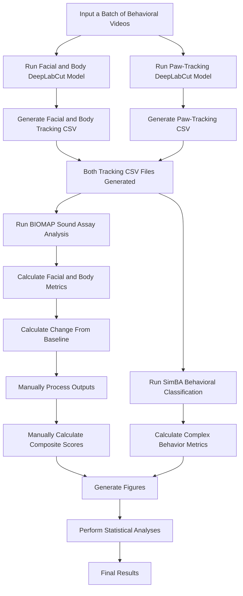

# Current BIOMAP Workflow

## Overview

The current BIOMAP workflow combines trained DeepLabCut models, SimBA, and custom Python analysis scripts to quantify pain-related behavior from behavioral videos.

While the workflow has successfully supported published research, it requires numerous manual steps, transitions between independent software packages, and repeated user interaction. Several downstream analyses, including composite score calculation, figure generation, and statistical analysis, are currently performed manually.

The purpose of this document is to describe the current workflow and identify opportunities for automation during BrainHack.

---

# Current Workflow

### BIOMAP outputs

- Individual facial and body-position metrics, including Ear Ratio and Eye Ratio
- Percent change from baseline for each sound-level condition
- Facial Grimace and Body Position composite scores

### SimBA outputs

- Grooming
- Rearing
- Pausing
- Respiration

### Current manual processing

- Convert cumulative nose-tip crossings into epoch-specific counts
- Normalize the 10-minute baseline to a 2-minute equivalent
- Calculate composite scores
- Generate figures
- Perform statistical analyses

---

# Current Manual Steps

The following steps currently require manual user interaction:

| Step | Current Method |
|------|----------------|
| Run trained DeepLabCut models | GUI |
| Export tracking CSV files | GUI |
| Run BIOMAP analysis script | Python script with user-specified inputs (CSV path, frame ranges, output name) |
| Calculate percent change from baseline | Automated within BIOMAP analysis script |
| Correct nose-tip crossing measurements | Manual |
| Calculate Facial Grimace composite score | Manual |
| Calculate Body Position composite score | Manual |
| Run SimBA | GUI |
| Generate figures | Manual |
| Statistical analysis | Manual |

---
