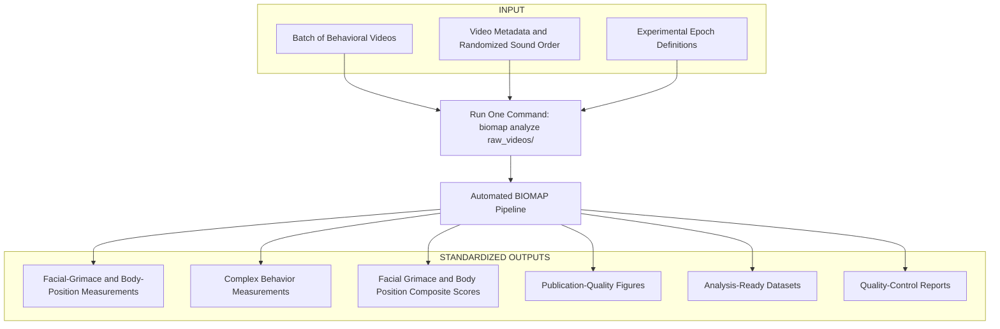

# Desired BIOMAP Workflow

## Vision

The long-term goal of the BIOMAP project is to transform the current manual behavioral analysis workflow into a reproducible, automated, and open-source software pipeline.

Rather than requiring users to manually transition between multiple software packages and perform downstream analyses by hand, BIOMAP should provide a single command that executes the complete behavioral analysis workflow, from raw behavioral videos to publication-ready figures and analysis-ready datasets.

---

# Desired User Experience

A researcher should be able to analyze an entire experiment with a single command.

```bash
biomap analyze data/raw_videos/
```

Once started, the pipeline should automatically complete the remaining analysis without requiring user interaction.

---

# Desired Pipeline

From the researcher’s perspective, the entire workflow should be reduced to one input, one command, and one standardized set of outputs.


---

# Desired Outputs

Following successful analysis, the pipeline should automatically generate a standardized output directory.

```text
results/

├── facial_metrics.csv
├── body_position_metrics.csv
├── complex_behavior_metrics.csv
├── facial_grimace_composite_scores.csv
├── body_position_composite_scores.csv
│
├── figures/
│   ├── facial_metrics.pdf
│   ├── body_position_metrics.pdf
│   ├── complex_behavior.pdf
│   ├── facial_grimace_composite_scores.pdf
│   └── body_position_composire_scores.pdf
│
└──  reports/
    └── summary_report.html

```
---

# Design Principles

The BIOMAP pipeline should be:

- Automated
- Reproducible
- Modular
- Open source
- User friendly
