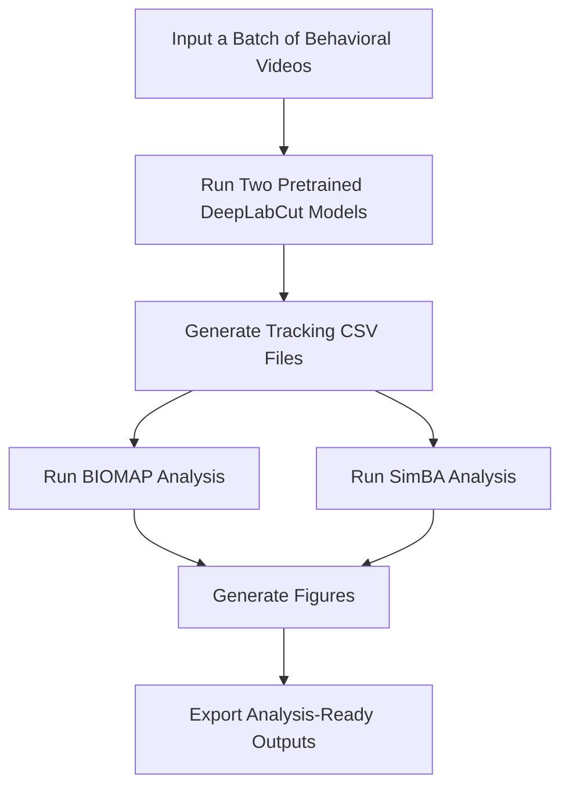

# BIOMAP Pipeline Components

## Overview

The BIOMAP workflow consists of several software tools and analysis steps that transform behavioral videos into quantitative measures of pain-related behavior.

This document breaks the workflow into independent components that contributors can improve during BrainHack. Each component can be developed independently, and completing the entire pipeline is **not** expected.

---

# Pipeline Summary

---

# Component 1 — Video Metadata

Develop a standardized way to describe experimental videos and analysis epochs.

Potential tasks:

- Create metadata files (CSV, YAML, or JSON)
- Define experimental epochs
- Automate frame-range identification
- Validate video organization

**Helpful skills**

- Python
- Data organization
- Experimental design

---

# Component 2 — DeepLabCut Integration

Automate execution of the existing trained DeepLabCut models across batches of videos.

Potential tasks:

- Run multiple trained DLC models
- Process videos in batches
- Generate tracking CSV/H5 files
- Organize outputs

**Helpful skills**

- DeepLabCut
- Python
- Computer vision

---

# Component 3 — BIOMAP Analysis

Integrate the existing BIOMAP analysis scripts into the automated pipeline.

Potential tasks:

- Calculate facial and body-position measurements
- Perform baseline normalization
- Automate nose-tip crossing correction
- Calculate Facial Grimace and Body Position composite scores
- Process multiple videos automatically

**Helpful skills**

- Python
- pandas
- Numerical analysis
- Behavioral neuroscience

---

# Component 4 — SimBA Integration

Automate the established SimBA workflow for complex behavioral analysis.

Potential tasks:

- Import tracking outputs automatically
- Run existing SimBA classifiers
- Export behavioral measurements
- Integrate results into the pipeline

**Helpful skills**

- SimBA
- Python
- Behavioral analysis

---

# Component 5 — Figure Generation

Automatically generate standardized publication-quality figures from BIOMAP and SimBA outputs.

Potential tasks:

- Standardize plots
- Generate reproducible figures
- Export publication-ready graphics

**Helpful skills**

- matplotlib
- Plotly
- Scientific visualization

---

# Component 6 — Data Export

Generate standardized output tables for downstream statistical analysis.

Potential tasks:

- Export CSV files
- Organize analysis outputs
- Support GraphPad Prism, R, and Python workflows

**Helpful skills**

- pandas
- Data organization

---

