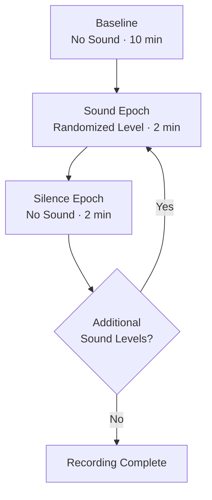

# BIOMAP Video Structure

## Overview

BIOMAP recordings contain:

* A 10-minute no-sound baseline
* Multiple 2-minute sound presentations
* A 2-minute silence period after each sound

Sound levels are presented in a randomized order each experimental day. The analysis pipeline must therefore use metadata—not epoch position—to identify each condition.

## Recording Timeline



Example randomized orders:

```text
Day 1: Baseline → 90 dB → Silence → 70 dB → Silence → 110 dB
Day 2: Baseline → 110 dB → Silence → 90 dB → Silence → 70 dB
```

## Metadata Requirements

Each recording needs a metadata file identifying the condition and timing of every experimental epoch.

Recommended fields:

| Field                 | Description                             |
| --------------------- | --------------------------------------- |
| `video_id`            | Unique recording identifier             |
| `file_name`           | Video filename                          |
| `mouse_id`            | Animal identifier                       |
| `experimental_date`   | Date of recording                       |
| `experimental_group`  | Experimental group                      |
| `sex`                 | Animal sex                              |
| `frame_rate`          | Verified video frame rate               |
| `epoch_order`         | Chronological epoch number              |
| `condition`           | Condition label                         |
| `sound_level_db`      | Sound level, if applicable              |
| `epoch_type`          | Baseline, sound, or silence             |
| `start_frame`         | First frame of the epoch                |
| `end_frame`           | Frame immediately after the epoch       |
| `duration_s`          | Epoch duration in seconds               |
| `preceding_condition` | Previous experimental condition         |
| `exclude`             | Whether the epoch should be excluded    |
| `notes`               | Interruptions or other relevant details |

## Example Metadata

```csv
video_id,file_name,epoch_order,condition,sound_level_db,epoch_type,start_frame,end_frame,duration_s,exclude
mouse01,mouse01.mp4,1,baseline,,baseline,0,18000,600,false
mouse01,mouse01.mp4,2,90_dB,90,sound,18000,21600,120,false
mouse01,mouse01.mp4,3,silence_after_90,,silence,21600,25200,120,false
mouse01,mouse01.mp4,4,110_dB,110,sound,25200,28800,120,false
mouse01,mouse01.mp4,5,silence_after_110,,silence,28800,32400,120,false
```

This example assumes a frame rate of 30 frames per second and treats `end_frame` as exclusive. Actual frame ranges must be based on the verified frame rate and experimental timing.

## Epoch Identification

The current BIOMAP script requires users to enter start and stop frames manually.

The desired pipeline should instead read epoch boundaries from metadata generated through one of the following methods:

1. Manual entry after each experiment
2. Timestamps exported from the acquisition software
3. Conversion of timestamps to video frames
4. Automatic event detection using a synchronized trigger

## Baseline Comparison

The 10-minute baseline is the reference condition for each 2-minute sound or silence epoch.

Averages, ratios, angles, percentages, and other duration-independent measurements can be compared using the established BIOMAP method.

Count-based measurements must first be adjusted for the difference in epoch duration.

### Nose-Tip Crossing Example

The nose-tip crossing output is cumulative. Counts for each epoch must therefore be calculated by subtracting the cumulative value at the start of the epoch from the value at the end.

Example cumulative values:

```text
End of baseline:             45
End of 90 dB:                67
End of silence after 90 dB:  81
End of 110 dB:              100
```

Calculated epoch counts:

```text
Baseline per 2 minutes: 45 ÷ 5 = 9
90 dB:                  67 − 45 = 22
Silence after 90 dB:    81 − 67 = 14
110 dB:                100 − 81 = 19
```

General calculation:

```text
Epoch Count =
Cumulative Count at End − Cumulative Count at Start
```

Because the baseline is 10 minutes long, its total count is divided by five to produce a 2-minute equivalent.

## Baseline Normalization

For measurements reported as percent change from baseline:

```text
Percent Change =
((Condition Value − Baseline Value) / Baseline Value) × 100
```

The calculation and sign convention should remain consistent with the existing BIOMAP analysis script.

The pipeline should preserve:

* Raw baseline value
* Raw condition value
* Corrected condition value, when applicable
* Percent change from baseline
* Experimental condition label

## Validation Checks

Before analysis, the pipeline should verify that:

* Every video has matching metadata
* The frame rate is known
* Every epoch has valid start and end frames
* Epochs occur in chronological order
* Epochs do not overlap
* Frame ranges do not exceed the video length
* The baseline is approximately 10 minutes
* Sound and silence epochs are approximately 2 minutes
* Every sound epoch has the correct sound-level label
* The randomized sound order is preserved
* Excluded or interrupted epochs are clearly marked

## BrainHack Development Tasks

Potential development tasks include:

* Design the metadata schema and templates
* Match videos with metadata files
* Import timestamps from acquisition software
* Convert timestamps to frame numbers
* Detect missing or overlapping epochs
* Flag incorrect epoch durations
* Automate count-based corrections
* Generate a visual timeline for each recording
* Produce clear validation warnings

## Desired Workflow

The user should not need to enter start and stop frames each time the BIOMAP analysis is run.

```bash
biomap analyze \
    --input data/raw_videos/ \
    --metadata data/video_manifest.csv
```

The pipeline should then:

1. Match each video to its metadata
2. Identify all baseline, sound, and silence epochs
3. Preserve the randomized sound-level order
4. Apply the appropriate baseline and duration corrections
5. Run the BIOMAP analysis automatically
